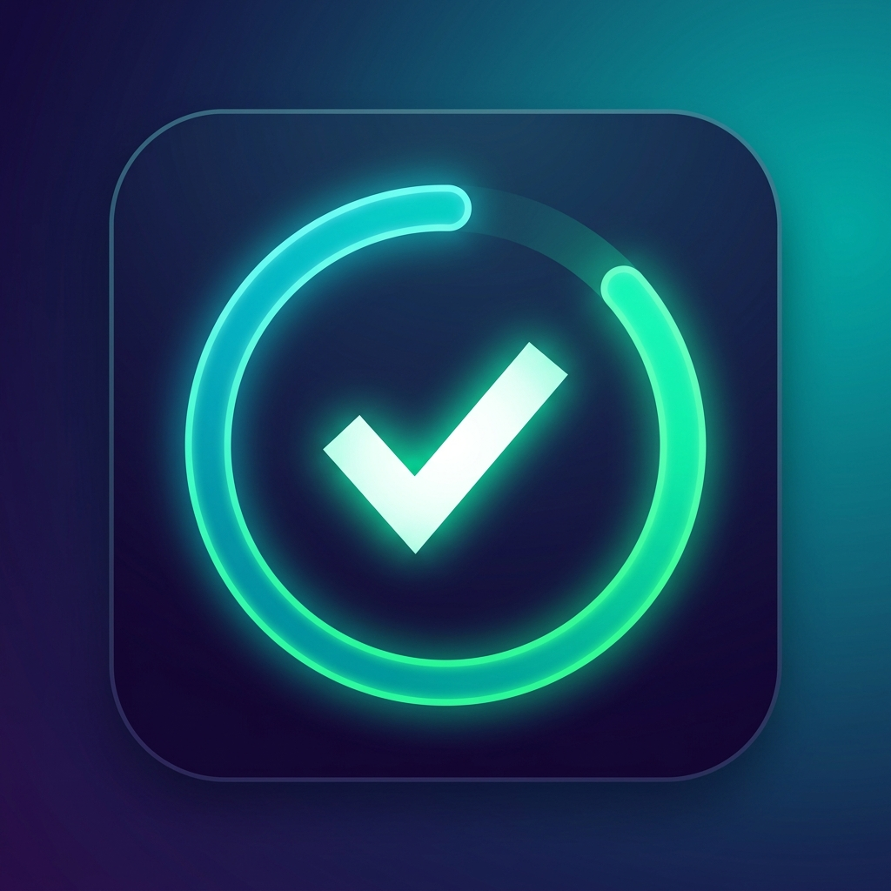

# 🌟 HabitFlow - Gestor de Hábitos Diarios para Android

<p align="center">
  
</p>

<p align="center">
  <b>Construye hábitos duraderos, mantén tus rachas y transforma tu rutina diaria.</b>
  <br />
  Una aplicación Android moderna, offline-first y fluida, construida con <b>Jetpack Compose</b>, <b>Material Design 3</b> y <b>Room Database</b> bajo los principios de <b>Clean Architecture</b>.
</p>

<p align="center">
  
  
  
  
  
  
  
  
</p>

---

## 📖 Tabla de Contenidos

- [Características Principales](#-características-principales)
- [Capturas de Pantalla](#-capturas-de-pantalla)
- [Arquitectura del Proyecto](#-arquitectura-del-proyecto)
- [Stack Tecnológico](#-stack-tecnológico)
- [Estructura de Directorios](#-estructura-de-directorios)
- [Requisitos Previos](#-requisitos-previos)
- [Instalación y Configuración](#-instalación-y-configuración)
- [Comandos de Gradle Útiles](#-comandos-de-gradle-útiles)
- [Testing](#-testing)
- [Contribución](#-contribución)
- [Licencia](#-licencia)

---

## ✨ Características Principales

- **🎯 Gestión Personalizada de Hábitos:**
  - Crea hábitos asignando títulos, descripciones y metas.
  - Categorización por áreas clave: *Salud & Bienestar*, *Ejercicio & Fitness*, *Productividad*, *Mindfulness & Calma*, *Aprendizaje* y *Rutina Diaria*.
  - Planificación por momento del día: *Mañana*, *Tarde*, *Noche* o *Cualquier momento*.
  - Selección de días programados de la semana (Lunes a Domingo).

- **🔥 Rachas (Streaks) y Constancia:**
  - Contador automático de racha actual en días consecutivos.
  - Registro de tu récord personal (mejor racha alcanzada).
  - Indicador visual interactivo de los últimos 7 días.

- **📊 Panel de Progreso y Estadísticas:**
  - Barra de progreso diario con porcentaje de cumplimiento en tiempo real.
  - Métricas de hábitos completados hoy vs. total programado.
  - Resumen de rachas activas y salud general del hábito.

- **🎨 Experiencia Visual Material Design 3:**
  - Soporte completo para Material 3 con animaciones fluidas (`AnimatedVisibility`, micro-interacciones).
  - Extended Floating Action Button (FAB) que se expande o contrae dinámicamente con el scroll.
  - Modal Bottom Sheet para la creación cómoda de hábitos con selectores visuales.
  - Filtros rápidos por momento del día mediante chips interactivos (`FilterChip`).

- **🔒 Offline-First y Privacidad Absoluta:**
  - Almacenamiento 100% local mediante SQLite gestionado con Room.
  - Tus datos personales y rutinas no salen de tu dispositivo.

---

## 📱 Capturas de Pantalla

> *(Puedes agregar aquí capturas de pantalla de la aplicación en ejecución)*

| Pantalla Principal (Hoy) | Creación de Hábito | Estadísticas y Rachas |
| :---: | :---: | :---: |
| *Lista de hábitos y progreso diario* | *ModalBottomSheet con categorías y horarios* | *Visualización de rachas y últimos 7 días* |

---

## 🏛 Arquitectura del Proyecto

El proyecto sigue una arquitectura **Clean Architecture + MVVM** con **Flujo Unidireccional de Datos (UDF)**:

```
┌────────────────────────────────────────────────────────┐
│                      UI Layer                          │
│   Jetpack Compose Composables  <───>  HomeViewModel    │
│            (StateFlow / UI State & Events)             │
└──────────────────────────┬─────────────────────────────┘
                           │ Invoca
┌──────────────────────────▼─────────────────────────────┐
│                    Domain Layer                        │
│   • HabitUseCases (GetHabits, ToggleHabit, CreateHabit)│
│   • HabitModels (Habit, HabitLog, HabitWithStatus)     │
│   • HabitRepository (Interfaz)                         │
└──────────────────────────┬─────────────────────────────┘
                           │ Implementa
┌──────────────────────────▼─────────────────────────────┐
│                     Data Layer                         │
│   • HabitRepositoryImpl                                │
│   • HabitDatabase (Room / SQLite)                      │
│   • DAOs (HabitDao, HabitLogDao)                       │
│   • Entities & Mappers                                 │
└────────────────────────────────────────────────────────┘
```

---

## 🛠 Stack Tecnológico

- **Lenguaje:** [Kotlin](https://kotlinlang.org/) (Coroutines, Flow, StateFlow)
- **UI Framework:** [Jetpack Compose](https://developer.android.com/jetpack/compose) con BOM actualizado
- **Diseño:** [Material Design 3 (M3)](https://m3.material.io/)
- **Persistencia Local:** [Room Database](https://developer.android.com/training/data-storage/room) con KSP (Kotlin Symbol Processing)
- **Inyección de Dependencias:** Patrón Contenedor (`AppContainer`) desacoplado y ligero
- **Build System:** Gradle Kotlin DSL (`build.gradle.kts`) con Version Catalogs (`libs.versions.toml`)
- **Testing:**
  - [JUnit 4](https://junit.org/junit4/) para pruebas unitarias.
  - [Robolectric](https://robolectric.org/) para pruebas locales en JVM sin necesidad de emulador.
  - [Roborazzi](https://github.com/takahirom/roborazzi) para Screenshot Testing automatizado.

---

## 📂 Estructura de Directorios

```plaintext
app/src/main/java/com/example/
├── data/
│   ├── local/
│   │   ├── dao/             # HabitDao.kt, HabitLogDao.kt
│   │   ├── entity/          # HabitEntity.kt, HabitLogEntity.kt
│   │   └── HabitDatabase.kt # Base de datos Room
│   ├── mapper/              # Mapeo entre entidades de base de datos y modelos de dominio
│   └── repository/          # Implementación del repositorio de hábitos
├── di/
│   └── AppContainer.kt      # Contenedor de dependencias de la aplicación
├── domain/
│   ├── model/               # Modelos de dominio inmutables (Habit, TimeOfDay, etc.)
│   ├── repository/          # Contrato de repositorio desacoplado
│   └── usecase/             # Casos de uso de negocio (UseCases)
├── ui/
│   ├── components/          # Componentes reutilizables (HabitCard, StatsOverview, etc.)
│   ├── home/                # Pantalla principal, ViewModel y UI State
│   └── theme/               # Paleta de colores M3, tipografía y tema
├── HabitFlowApplication.kt  # Clase Application para inicialización de dependencias
└── MainActivity.kt          # Punto de entrada Activity con Compose Scaffold
```

---

## 📋 Requisitos Previos

Antes de comenzar, asegúrate de tener instalado:

- **Android Studio:** Ladybug (2024.2+) o versión compatible reciente.
- **JDK:** Java 17 o Java 21 configurado en Android Studio.
- **Android SDK:**
  - `minSdkVersion`: 24 (Android 7.0 Nougat)
  - `targetSdkVersion`: 36
  - `compileSdkVersion`: 36

---

## 🚀 Instalación y Configuración

1. **Clonar el repositorio:**
   ```bash
   git clone https://github.com/TU_USUARIO/HabitFlow.git
   cd HabitFlow
   ```

2. **Abrir en Android Studio:**
   - Abre Android Studio.
   - Selecciona **Open** y navega hasta la carpeta del proyecto clonado.
   - Espera a que Gradle sincronice todas las dependencias (`Sync Project with Gradle Files`).

3. **Ejecutar la aplicación:**
   - Conecta un dispositivo físico con depuración USB habilitada o inicia un Emulador Android (API 24 o superior).
   - Presiona el botón verde de **Run** (`Shift + F10`) en Android Studio.

---

## ⚡ Comandos de Gradle Útiles

Puedes compilar y ejecutar tareas directamente desde la terminal:

```bash
# Compilar el APK de depuración (Debug)
./gradlew assembleDebug

# Compilar el APK de lanzamiento (Release)
./gradlew assembleRelease

# Ejecutar las pruebas unitarias y de arquitectura
./gradlew testDebugUnitTest

# Ejecutar pruebas de captura de pantalla con Roborazzi
./gradlew recordRoborazziDebug
./gradlew verifyRoborazziDebug
```

> **Nota para Windows:** Utiliza `gradlew.bat` en lugar de `./gradlew`.

---

## 🧪 Testing

El proyecto cuenta con una suite de pruebas para asegurar la calidad y estabilidad del código:

- **Tests de Dominio y Lógica (`HabitFlowDomainTest.kt`):** Pruebas unitarias sobre el cálculo de rachas, filtrado de días de la semana y estados de completitud.
- **Tests de Componentes con Robolectric (`ExampleRobolectricTest.kt`):** Pruebas de integración rápidas en JVM sin necesidad de iniciar un dispositivo o emulador.
- **Screenshot Testing (`GreetingScreenshotTest.kt`):** Pruebas de regresión visual para validar que los componentes de Compose no sufran alteraciones no deseadas.

Para ejecutar todas las pruebas:
```bash
./gradlew test
```

---

## 🤝 Contribución

¡Las contribuciones, reportes de bugs y sugerencias de nuevas características son bienvenidas!

1. Haz un **Fork** del proyecto.
2. Crea una rama para tu función (`git checkout -b feature/NuevaCaracteristica`).
3. Realiza tus cambios y haz commit (`git commit -m 'feat: Agregar nueva funcionalidad'`).
4. Haz push a la rama (`git push origin feature/NuevaCaracteristica`).
5. Abre un **Pull Request**.

---

## 📄 Licencia

Este proyecto está bajo la Licencia **MIT**. Consulta el archivo `LICENSE` para más detalles.

---

<p align="center">
  Hecho con ❤️ para la comunidad Android usando <b>Kotlin & Jetpack Compose</b>.
</p>
